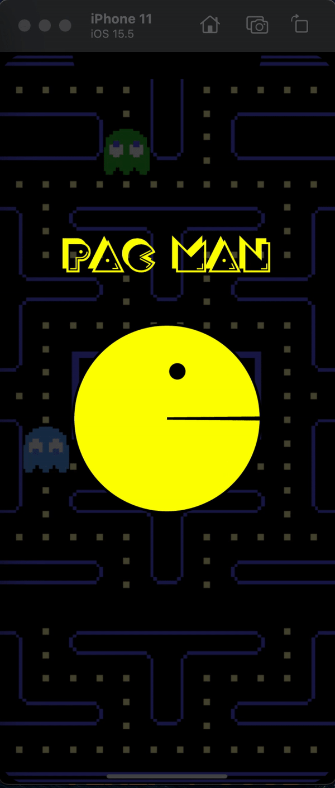

## 🎯 Animação do PacMan com canva

O foco deste aplicativo é reproduzir o PacMan apenas utilizando CustomPaint, por meio do uso de animações explicitas.

  

Veja mais sobre:

- [CustomPaint](https://medium.com/flutter-community/a-deep-dive-into-custompaint-in-flutter-47ab44e3f216).

- [Animações implicitas](https://docs.flutter.dev/development/ui/animations/implicit-animations)
